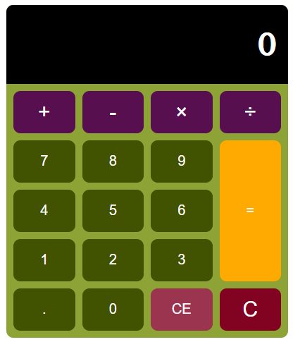

# Basic Calculator

[Calculator Demo preview](https://ramirune.github.io/ks-group-project-calculator/)

### Overview

The simple JavaScript Calcultor built with JavaScript, HTML and CSS. It provides basic function of calculator.

